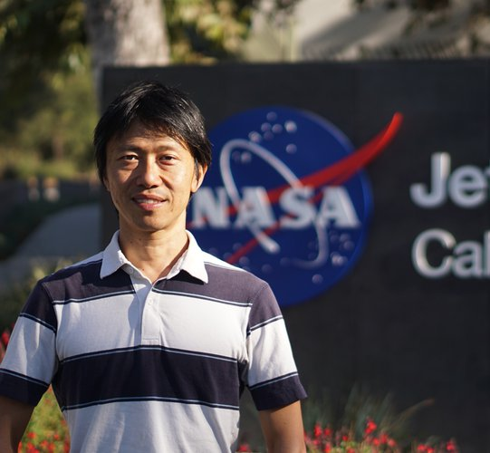

<meta property="og:title" content="RSS 2025 Workshop on Resilient Off-road Autonomous Robotics (ROAR)">
<meta property="og:description" content="Join us at RSS 2025 to explore the latest in resilient off-road autonomy. Submit your paper today!">
<meta property="og:image" content="images/rss2025_logo.png">
<meta property="og:url" content="https://off-roaders.github.io/off-road-workshop-2025/">
<meta property="og:type" content="website">

## General Information

<!-- The field of off-road autonomy has been of great interest due to applications in various industries, such as agriculture, search and rescue, and military operations. The dynamic and unpredictable nature of off-road environments poses unique challenges and opens avenues for all aspects of robotic research. The goal of this workshop is to engage experts and researchers in off-road autonomy, in a broad coverage of public datasets, benchmarks, software stacks, infrastructures, state estimation, semantic segmentation, traversability estimation, terrain analysis, planning, dynamics model, domain adaptation, and more. -->

The Resilient Off-road Autonomous Robotics (ROAR) builds on the success of [the ICRA 2024 Workshop on Resilient Off-road Autonomy](https://theairlab.org/icra2024_offroad_workshop/) with a refined and sharpened focus on tackling the unique challenges posed by unstructured, unpredictable, and dynamic off-road environments. These settings require advanced capabilities in perception, localization, planning, and control - areas where conventional autonomous systems often fall short. 

Beyond canonical topics such as robust navigation in GPS-denied areas and terrain-adaptive control strategies, the workshop will explore cutting-edge advancements. These include multi-modal perception using novel sensor modalities (e.g., radar for robust navigation, thermal cameras for visibility in low-light conditions, and event cameras for high-speed motion detection). Advanced scene representation techniques, such as NeRF for photorealistic scene reconstruction and 3D Gaussian Splatting for efficient map representations, will also be discussed. The workshop will highlight online learning approaches to enable real-time adaptation to dynamic off-road environments and examine how foundation models can contribute to generalizable and scalable off-road autonomy. Additionally, a significant focus will be placed on practical strategies for creating comprehensive datasets and establishing robust benchmarks tailored to off-road environments, emphasizing the importance of large-scale, high-quality data for method development and training.

This will be a full-day workshop. It will feature a mix of presentations, open panel discussions, and an invited poster session. The workshop targets academics and researchers in robotics, AI, and machine learning, focusing on autonomous systems for off-road applications. It also engages industry professionals from agriculture, mining, defense, and planetary exploration, along with representatives from organizations like NASA and DARPA.

## 📢 Updates!
- 🔗 Online Access: Join the workshop via [Zoom Link](https://tamu.zoom.us/j/94768793003?pwd=XvqQNfkJcDiBeR4DHlF7WalvfEjRWe.1
)/[Zoom Invitation](info/RSS2025_ROAR_Zoom_Invitation.txt)

- 🗓️ Poster Schedule Released: Please check the schedule [here](info/RSS2025_ROAR_Poster_Schedules.pdf)

- 📄 Accepted Papers: All accepted papers are now available on [OpenReview](https://openreview.net/group?id=roboticsfoundation.org/RSS/2025/Workshop/ROAR&referrer=%5BHomepage%5D(%2F)#tab-accept-oral)

## 📍 Location
- **Workshop Location**: [Olin Hall of Engineering (OHE)](https://www.google.com/maps/place/Olin+Hall,+3650+McClintock+Ave,+Los+Angeles,+CA+90089/@34.0206843,-118.2894991,1509m/data=!3m2!1e3!4b1!4m6!3m5!1s0x80c2c7fca3be47df:0x34ec8b40e042d9e3!8m2!3d34.0206843!4d-118.2894991!16s%2Fg%2F11c5nmb8fx?entry=ttu&g_ep=EgoyMDI1MDYwMy4wIKXMDSoASAFQAw%3D%3D) Room 100B

- **Poster Location**: [Epstein Family Plaza](https://www.google.com/maps/place/Epstein+Family+Plaza/@34.0203999,-118.2889305,751m/data=!3m2!1e3!4b1!4m6!3m5!1s0x80c2c7fca3f9c71b:0xf96e16d9646c062b!8m2!3d34.0203999!4d-118.2889305!16s%2Fg%2F1tcw3wzp?entry=ttu&g_ep=EgoyMDI1MDYxNi4wIKXMDSoASAFQAw%3D%3D)

## Awards

Thank you for the sponsor from [Field AI](https://www.fieldai.com/). The following prizes will be presented:

- **Best Paper Award** – USD 500  
- **Best Paper Runner-Up** – USD 250  
- **Best Poster Award** – USD 500  
- **Best Poster Runner-Up** – USD 250  

🎖️ Congratulations to our award winners, made possible by the generous support of Field AI:
---
### 🏆 Best Paper

**[Long Range Navigator (LRN): Extending robot planning horizons beyond metric maps](https://openreview.net/forum?id=JbwHcSg2ZF)**
Matt Schmittle, Rohan Baijal , Nathan Hatch , Rosario Scalise , Mateo Guaman Castro , Sidharth Talia , Khimya Khetarpal, Byron Boots , Siddhartha Srinivasa

----

### 🥈 Best Paper Runner-up

**[OVERSEEC – Open-Vocabulary Cost Map Generation from Satellite Images and Natural Language](https://openreview.net/forum?id=H6jEME4PpM)**

Rwik Rana, Jesse Quattrociocchi, Dongmyeong Lee, Christian Ellis, Amanda Adkins, Adam Uccello, Garrett Warnell, Joydeep Biswas

----
### 🖼️ Best Poster
**[Meta-Learning Online Dynamics Model Adaptation in Off-Road Autonomous Driving](https://openreview.net/forum?id=jnKYdHfFWA)**

Jacob Levy, Jason Gibson, Bogdan Vlahov, Erica Tevere, Evangelos Theodorou, David Fridovich-Keil, Patrick Spieler

----
### 🥈 Best Poster Runner-up
**[MAGIC-VFM - Meta-learning Adaptation for Ground Interaction Control with Visual Foundation Models](https://openreview.net/forum?id=xg7kLAXqwo)**

Elena Sorina Lupu, Fengze Xie, James A Preiss, Jedidiah Alindogan, Matthew Anderson, Soon-Jo Chung

## Speakers and Panelists

  

    
    <figcaption>
        <a href="http://asrl.utias.utoronto.ca/~tdb/">Tim Barfoot</a>
    </figcaption>
  

  

    
    <figcaption>
        <a href="https://www.tudelft.nl/en/staff/m.popovic/?cHash=9c4e89537f3df185c588b06c8bece9d2">Marija Popović</a>
    </figcaption>
  

  

    
    <figcaption>
        <a href="https://www-robotics.jpl.nasa.gov/who-we-are/people/masahiro_ono/">Masahiro (Hiro) Ono</a>
    </figcaption>
  
  
  

    
    <figcaption>
        <a href="https://www.cs.umd.edu/people/dmanocha">Dinesh Manocha</a>
    </figcaption>
  

  

    
    <figcaption>
        <a href="https://www.darpa.mil/staff/dr-stuart-young">Stuart Young</a>
    </figcaption>
  

  

    
    <figcaption>
        <a href="https://urobot.kaist.ac.kr/url_teams/prof-hyunmyung/">Hyun Myung</a>
    </figcaption>
  

  

    
    <figcaption>
        <a href="https://www.ise.msstate.edu/people/adjunct-faculty/anton-netchaev/">Anton Netchaev</a>
    </figcaption>
  
     
  

    
    <figcaption>
        <a href="https://homes.cs.washington.edu/~bboots/">Byron Boots
</a>
    </figcaption>
  
    
  

    
    <figcaption>
        <a href="https://www.joydeepb.com/">Joydeep Biswas
</a>
    </figcaption>
  
  

## Schedule

Time  &emsp;&emsp;&emsp;&emsp;&emsp;&emsp; | Session
--- | ---
08:15-08:30 | Opening Remarks
08:30-09:00 | Keynote Talk 1: Radar Localization for Driving Off the Road (Tim Barfoot)
09:00-09:30 | Keynote Talk 2: Learning Robust Computer Vision in Unknown Environments (Marija Popović)
09:30-09:45 | Oral Presentation 1: Meta-Learning Online Dynamics Model Adaptation in Off-Road Autonomous Driving
09:45-10:30 | Coffee break and Poster Session
10:30-11:00 | Keynote Talk 3: Robot Navigation in Complex Indoor and Outdoor Environment (Dinesh Manocha)
11:00-11:30 | Keynote Talk 4: Future Surface and Aerial Mobility for Mars Exploration (Masahiro (Hiro) Ono)
11:30-11:45 | Oral Presentation 2: OVerSeeC – Open-Vocabulary CostMap Generation from Satellite Images and Natural Language
11:45-12:00 | Oral Presentation 3: Online Adaptation of Terrain-Aware Dynamics for Planning in Unstructured Environments
12:00-12:15 | Oral Presentation 4: 	Kinodynamic Motion Planning for Mobile Robot Navigation across Inconsistent World Models
12:15-12:30 | Oral Presentation 5: 	Long Range Navigator (LRN): Extending robot planning horizons beyond metric maps
12:30-14:00 | Lunch Break.
14:00-14:30 | Keynote Talk 5: Off Road Autonomy in Feature Sparse Environments (Anton Netchaev)
14:30-15:00 | Keynote Talk 6: Thoughts on Machine Learning and Off-Road Ground Vehicle Autonomy (Byron Boots)
15:00-15:30 | Keynote Talk 7: Reading the Dirt: Learning What Matters (and What Doesn’t) for Off-Road Navigation (Joydeep Biswas)
15:30-16:00 | Coffee break and Poster Session
16:00-16:30 | Keynote Talk 8: Spatial AI and ML for Autonomous Robot Navigation in Rough Terrains (Hyun Myung)
16:30-17:00 | Keynote Talk 9: Robotic Autonomy in Complex Environments with Resiliency (Stuart Young)
17:00-17:50 | Panel Discussion: Foundation Models and Large Language Models in Off-Road Robotics: Hype or Reality?
17:50-18:00 | Closing Remarks.

## Poster Sessions
### Session A - 9:30-10:20 AM (Epstein Plaza)
---
**Long Range Navigator (LRN): Extending Robot Planning Horizons Beyond Metric Maps**
*Matt Schmittle, Rohan Baijal, Nathan Hatch, Rosario Scalise, Mateo Guaman Castro, Sidharth Talia, Khimya Khetarpal, Byron Boots, Siddhartha Srinivasa*

---

**Kinodynamic Motion Planning for Mobile Robot Navigation Across Inconsistent World Models**
*Eric R. Damm, Thomas Howard*

---

**Online Adaptation of Terrain-Aware Dynamics for Planning in Unstructured Environments**
*William Ward, Sarah Etter, Tyler Ingebrand, Christian Ellis, Adam Thorpe, Ufuk Topcu*

---

**OVerSeeC – Open-Vocabulary CostMap Generation from Satellite Images and Natural Language**
*Rwik Rana, Jesse Quattrociocchi, Dongmyeong Lee, Christian Ellis, Amanda Adkins, Adam Uccello, Garrett Warnell, Joydeep Biswas*

---

**Meta-Learning Online Dynamics Model Adaptation in Off-Road Autonomous Driving**
*Jacob Levy, Jason Gibson, Bogdan Vlahov, Erica Tevere, Evangelos Theodorou, David Fridovich-Keil, Patrick Spieler*

---

**GND: An Outdoor Global Navigation Dataset with Multi-Modal Perception and Traversability**
*Jing Liang, Dibyendu Das, Daeun Song, MD Nahid Hasan Shuvo, Sina Mansouri, Dinesh Manocha, Xuesu Xiao*

---

**Verti-Bench: A General and Scalable Off-Road Mobility Benchmark for Vertically Challenging Terrain**
*Tong Xu, Chenhui Pan, Madhan B. Rao, Aniket Datar, Anuj Pokhrel, Yuanjie Lu, Xuesu Xiao*

---

**VertiSelector: Automatic Curriculum Learning for Wheeled Mobility on Vertically Challenging Terrain**
*Tong Xu, Chenhui Pan, Xuesu Xiao*

---

**Learning Smooth State-Dependent Traversability from Dense Point Clouds**
*Zihao Dong, Alan Papalia, Leonard Jung, Alenna Spiro, Philip R Osteen, Christa S. Robison, Michael Everett*

---
### Session C 3:00-3:50 PM (Epstein Plaza)

---

**Traverse the Non-Traversable: Estimating Traversability for Wheeled Mobility on Vertically Challenging Terrain**
*Aniket Datar, Chenhui Pan, Anuj Pokhrel, Matthew Choulas, Mohammad Nazeri, Tong Xu, Xuesu Xiao*

---

**M2P2: A Multi-Modal Passive Perception Dataset for Off-Road Mobility in Extreme Low-Light Conditions**
*Aniket Datar, Anuj Pokhrel, Mohammad Nazeri, Madhan B. Rao, Harsh Rangwala, Chenhui Pan, Yufan Zhang, Andre Harrison, Maggie Wigness, Philip R Osteen, Jinwei Ye, Xuesu Xiao*

---

**Dynamics Modeling using Visual Terrain Features for High-Speed Autonomous Off-Road Driving**
*Jason Gibson, Anoushka Alavilli, Erica Tevere, Evangelos Theodorou, Patrick Spieler*

---

**ADEPT: Adaptive Diffusion Environment for Policy Transfer Sim-to-Real**
*Youwei Yu, Junhong Xu, Lantao Liu*

---

**LunarLoc: Segment-Based Global Localization on the Moon**
*Annika Thomas, Robaire Galliath, Aleksander T Garbuz, Luke R Anger, Cormac ONeill, Trevor E Johst, Dami V Thomas, George Lordos, Jonathan P How*

---

**MAGIC-VFM: Meta-Learning Adaptation for Ground Interaction Control with Visual Foundation Models**
*Elena Sorina Lupu, Fengze Xie, James A Preiss, Jedidiah Alindogan, Matthew Anderson, Soon-Jo Chung*

---

**Wheeled Lab: Modern Sim2Real for Low-Cost, Open-Source Wheeled Robotics**
*Tyler Han, Preet Shah, Sidharth Rajagopal, Yanda Bao, Sanghun Jung, Sidharth Talia, Gabriel Guo, Bryan Xu, Bhaumik Mehta, Emma Romig, Rosario Scalise, Byron Boots*

---

**BEV-Patch-PF: Particle Filtering with BEV-Aerial Feature Matching for Off-Road Geo-Localization**
*Dongmyeong Lee, Jesse Quattrociocchi, Christian Ellis, Rwik Rana, Amanda Adkins, Adam Uccello, Garrett Warnell, Joydeep Biswas*

---
**Learning to Predict Mobile Robot Stability in Off-Road Environments**
*Nathaniel Rose, Arif Ahmed, Emanuel Gutierrez-Cornejo, Parikshit Maini*

## Topics Covered

- Multi-modal perception
- Self-supervised learning
- Sim-to-real transfer
- Sensor fusion techniques (modalities such as radar, thermal, and event camera).
- Learning-based methods for off-road navigation
- Online adaptation
- Traversability estimation
- Foundation models for navigation
- Heterogeneous collaborative robots
- Data collection and generation techniques for off-road environments
- Off-road driving datasets
- Cross-domain transfer for off-road applications
- Scene understanding and reconstruction (e.g. but not limited to, NeRF, Neural Representations)
- Open-set visual recognition methods under constrained conditions (image and video classification, object detection, and segmentation)
- Safe robot operation in uncertain and dynamic environments
- Planning without prior knowledge of an environment
- Approaches to off-road driving that work on multiple types of robots
- Long-term localization and mapping in complex/GPS-denied environments
- Representations of terrain that model physical properties and robot-environment interaction

## Submission Instructions

- Submissions should follow the [RSS 2025 paper format](https://roboticsconference.org/information/cfp/#:~:text=RSS%202025%20has%20no%20page%20length%20requirements%20on%20submissions.%20Traditionally%2C%20RSS%20submissions%20have%20been%208%20pages%20given%20the%20paper%20template%2C%20which%20is%20available%20either%20in%20LaTeX%20or%20Word%20format.).
- Reviews will be conducted in a double-blind manner; please ensure your paper is properly anonymized.
- While there is no strict page limit, we recommend a length of 4–8 pages, excluding references and supplementary material.
- Papers must be submitted via [OpenReview](https://openreview.net/group?id=roboticsfoundation.org/RSS/2025/Workshop/ROAR&referrer=%5BHomepage%5D(%2F)#tab-your-consoles). 
- Accepted papers will be presented as posters, with a select few invited for spotlight presentations.

## Important Dates

- Submission Start: ~~Apr 01 2025 12:00AM UTC-0~~
- Submission Deadline: ~~May 01 2025 12:00AM UTC-0~~ May 15 2025 AoE
- Acceptance Notification: ~~May 16 2025 12:00AM UTC-0~~ May 29 2025 AoE
- Camera-Ready Deadline: ~~June 01 2025 12:00AM UTC-0~~ June 05 2025 AoE
- Workshop Date: Jun 25th 2025

## Online Participation

All sessions, including invited talks, paper presentations, and panel discussions, will be live-streamed. Recordings will be made available after the event to accommodate participants in different time zones. Moreover, online attendees will have the opportunity to actively engage in live Q&A sessions via Zoom chat.

## Organizers

<!-- First row (8 people) -->

  

    
    <figcaption>
        <a href="https://engineering.tamu.edu/mechanical/profiles/saripalli.html">Srikanth Saripalli</a>
    </figcaption>
  

  

    
    <figcaption>
        <a href="https://theairlab.org/team/sebastian">Sebastian Scherer</a>
    </figcaption>
  

  

    
    <figcaption>
        <a href="https://www.ri.cmu.edu/ri-faculty/wenshan-wang/">Wenshan Wang</a>
    </figcaption>
  
    
  

    
    <figcaption>
        <a href="https://cs.gmu.edu/~xiao/">Xuesu Xiao</a>
    </figcaption>  
  

  

    
    <figcaption>
        <a href="https://rl.uni-freiburg.de/people/valada">Abhinav Valada</a>
    </figcaption>
  
  
  

    
    <figcaption>
        <a href="https://www.linkedin.com/in/maggie-wigness/">Maggie Wigness</a>
    </figcaption>
  
  
  

    
    <figcaption>
        <a href="https://www.linkedin.com/in/john-rogers-41921a12/">John Rogers</a>
    </figcaption>
  

  

    
    <figcaption>
        <a href="https://www.linkedin.com/in/phil-osteen-3bb19741/">Philip Osteen</a>
    </figcaption>
  

<!-- Second row (8 people) -->

  

    
    <figcaption>
        <a href="https://www.linkedin.com/in/jason-gregory-88b70b167/">Jason Gregory</a>
    </figcaption>  
  

  

    
    <figcaption>
        <a href="https://www.linkedin.com/in/christian-ellis-research/">Christian Ellis</a>
    </figcaption>
  
  
  

    
    <figcaption>
        <a href="https://www.linkedin.com/in/peng-jiang-8a6926128/">Peng Jiang</a>
    </figcaption>
  

  

    
    <figcaption>
        <a href="https://www.linkedin.com/in/alvikagautam">Alvika Gautam</a>
    </figcaption>
  

  

    
    <figcaption>
        <a href="https://www.linkedin.com/in/kasi-viswanath-4197851b6/">Kasi Viswanath</a>
    </figcaption>
  

  

    
    <figcaption>
        <a href="https://www.linkedin.com/in/akhil-nagariya/">Akhil Nagariya</a>
    </figcaption>
  

  

    
    <figcaption>
        <a href="https://theairlab.org/team/sam_triest/">Samuel Triest</a>
    </figcaption>  
  

  

    
    <figcaption>
        <a href="https://shubhraaich.github.io/">Shubhra Aich</a>
    </figcaption>
  

<!-- Third row (7 people) -->

  

    
    <figcaption>
        <a href="https://matthewjsiv.github.io/">Matthew Sivaprakasam</a>
    </figcaption>
  

  

    
    <figcaption>
        <a href="https://theairlab.org/team/micah_nye/">Micah Nye</a>
    </figcaption>
  
  
  

    
    <figcaption>
        <a href="https://thanandnow.github.io/">Tyler Han</a>
    </figcaption>  
  

  

    
    <figcaption>
        <a href="https://rohanblueboybaijal.github.io/">Rohan Baijal</a>
    </figcaption>
  
  
  

    
    <figcaption>
        <a href="https://mateoguaman.com/">Mateo Guaman Castro</a>
    </figcaption>
  

  

    
    <figcaption>
        <a href="https://www.linkedin.com/in/ashwin-menon-060147149/">Ashwin Menon</a>
    </figcaption>
  

  

    
    <figcaption>
        <a href="https://www.linkedin.com/in/eric-damm-b7a05090/">Eric Damm</a>
    </figcaption>  
  

## Sponsors
<!-- 

  

    
    <a href="https://www.fieldai.com/">
    </img>
  

 -->

  

    
  

