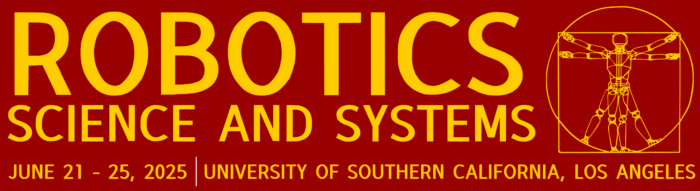
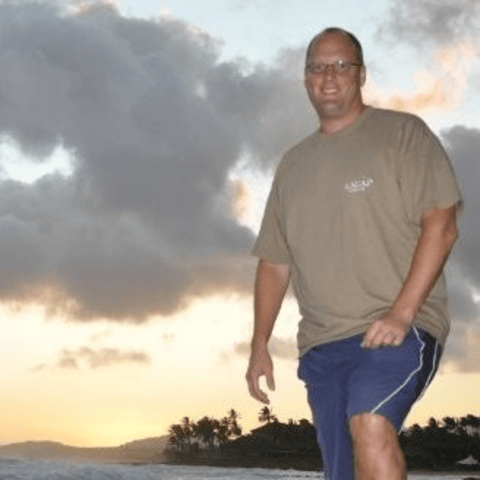
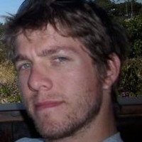
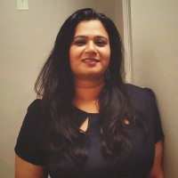
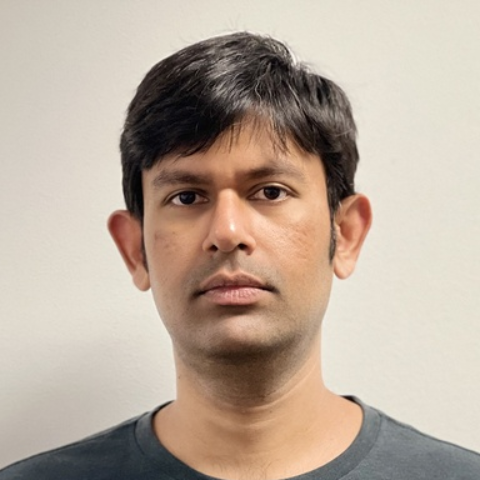
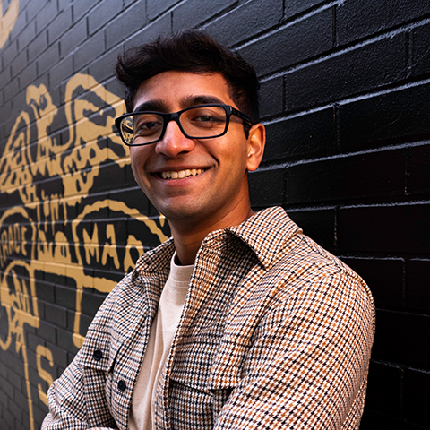
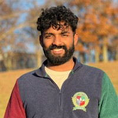

<meta property="og:title" content="RSS 2025 Workshop on Resilient Off-road Autonomous Robotics (ROAR)">
<meta property="og:description" content="Join us at RSS 2025 to explore the latest in resilient off-road autonomy. Submit your paper today!">
<meta property="og:image" content="images/rss2025_logo.png">
<meta property="og:url" content="https://off-roaders.github.io/off-road-workshop-2025/">
<meta property="og:type" content="website">

## General Information

<!-- The field of off-road autonomy has been of great interest due to applications in various industries, such as agriculture, search and rescue, and military operations. The dynamic and unpredictable nature of off-road environments poses unique challenges and opens avenues for all aspects of robotic research. The goal of this workshop is to engage experts and researchers in off-road autonomy, in a broad coverage of public datasets, benchmarks, software stacks, infrastructures, state estimation, semantic segmentation, traversability estimation, terrain analysis, planning, dynamics model, domain adaptation, and more. -->

The Resilient Off-road Autonomous Robotics (ROAR) builds on the success of [the ICRA 2024 Workshop on Resilient Off-road Autonomy](https://theairlab.org/icra2024_offroad_workshop/) with a refined and sharpened focus on tackling the unique challenges posed by unstructured, unpredictable, and dynamic off-road environments. These settings require advanced capabilities in perception, localization, planning, and control - areas where conventional autonomous systems often fall short. 

Beyond canonical topics such as robust navigation in GPS-denied areas and terrain-adaptive control strategies, the workshop will explore cutting-edge advancements. These include multi-modal perception using novel sensor modalities (e.g., radar for robust navigation, thermal cameras for visibility in low-light conditions, and event cameras for high-speed motion detection). Advanced scene representation techniques, such as NeRF for photorealistic scene reconstruction and 3D Gaussian Splatting for efficient map representations, will also be discussed. The workshop will highlight online learning approaches to enable real-time adaptation to dynamic off-road environments and examine how foundation models can contribute to generalizable and scalable off-road autonomy. Additionally, a significant focus will be placed on practical strategies for creating comprehensive datasets and establishing robust benchmarks tailored to off-road environments, emphasizing the importance of large-scale, high-quality data for method development and training.

This will be a full-day workshop. It will feature a mix of presentations, open panel discussions, and an invited poster session. The workshop targets academics and researchers in robotics, AI, and machine learning, focusing on autonomous systems for off-road applications. It also engages industry professionals from agriculture, mining, defense, and planetary exploration, along with representatives from organizations like NASA and DARPA.

## Topics Covered

- Multi-modal perception
- Self-supervised learning
- Sim-to-real transfer
- Sensor fusion techniques (modalities such as radar, thermal, and event camera).
- Learning-based methods for off-road navigation
- Online adaptation
- Traversability estimation
- Foundation models for navigation
- Heterogeneous collaborative robots
- Data collection and generation techniques for off-road environments
- Off-road driving datasets
- Cross-domain transfer for off-road applications
- Scene understanding and reconstruction (e.g. but not limited to, NeRF, Neural Representations)
- Open-set visual recognition methods under constrained conditions (image and video classification, object detection, and segmentation)
- Safe robot operation in uncertain and dynamic environments
- Planning without prior knowledge of an environment
- Approaches to off-road driving that work on multiple types of robots
- Long-term localization and mapping in complex/GPS-denied environments
- Representations of terrain that model physical properties and robot-environment interaction

## Submission Instructions

- Submissions should follow the [RSS 2025 paper format](https://roboticsconference.org/information/cfp/#:~:text=RSS%202025%20has%20no%20page%20length%20requirements%20on%20submissions.%20Traditionally%2C%20RSS%20submissions%20have%20been%208%20pages%20given%20the%20paper%20template%2C%20which%20is%20available%20either%20in%20LaTeX%20or%20Word%20format.).
- Reviews will be conducted in a double-blind manner; please ensure your paper is properly anonymized.
- While there is no strict page limit, we recommend a length of 4–8 pages, excluding references and supplementary material.
- Papers must be submitted via [OpenReview](https://openreview.net/group?id=roboticsfoundation.org/RSS/2025/Workshop/ROAR&referrer=%5BHomepage%5D(%2F)#tab-your-consoles). 
- Accepted papers will be presented as posters, with a select few invited for spotlight presentations.

## Important Dates

- Submission Start: Apr 01 2025 12:00AM UTC-0
- Submission Deadline: ~~May 01 2025 12:00AM UTC-0~~ May 15 2025 12:00AM UTC-0
- Acceptance Notification: ~~May 16 2025 12:00AM UTC-0~~ May 29 2025 12:00AM UTC-0
- Camera-Ready Deadline: ~~June 01 2025 12:00AM UTC-0~~ June 05 2025 12:00AM UTC-0
- Workshop Date: Jun 25th 2025

## Awards

Thank you for the sponsor from [Field AI](https://www.fieldai.com/). The following prizes will be presented:

- **Best Paper Award** – USD 500  
- **Best Paper Runner-Up** – USD 250  
- **Best Poster Award** – USD 500  
- **Best Poster Runner-Up** – USD 250  

## Speakers and Panelists

  

    
    <figcaption>
        <a href="http://asrl.utias.utoronto.ca/~tdb/">Tim Barfoot</a>
    </figcaption>
  

  

    
    <figcaption>
        <a href="https://www.tudelft.nl/en/staff/m.popovic/?cHash=9c4e89537f3df185c588b06c8bece9d2">Marija Popović</a>
    </figcaption>
  

  

    
    <figcaption>
        <a href="https://robotics.jpl.nasa.gov/who-we-are/people/larry_matthies/">Larry Matthies</a>
    </figcaption>
  
  
  

    
    <figcaption>
        <a href="https://www.cs.umd.edu/people/dmanocha">Dinesh Manocha</a>
    </figcaption>
  

  

    
    <figcaption>
        <a href="https://www.darpa.mil/staff/dr-stuart-young">Stuart Young</a>
    </figcaption>
  

  

    
    <figcaption>
        <a href="https://urobot.kaist.ac.kr/url_teams/prof-hyunmyung/">Hyun Myung</a>
    </figcaption>
  

  

    
    <figcaption>
        <a href="https://www.ise.msstate.edu/people/adjunct-faculty/anton-netchaev/">Anton Netchaev</a>
    </figcaption>
  
     
  

    
    <figcaption>
        <a href="https://homes.cs.washington.edu/~bboots/">Byron Boots
</a>
    </figcaption>
  
    
  

    
    <figcaption>
        <a href="http://www2.informatik.uni-freiburg.de/~burgard/">Wolfram Burgard
</a>
    </figcaption>
  
  

<!-- ## Challenge

Ahead of the event, we are excited to announce a **competitive challenge** centered around a newly developed off-road dataset. This challenge is designed to push the boundaries of innovation in off-road autonomy, featuring cutting-edge tasks such as:

- **Zero-Shot Semantic Segmentation**
- **Novel View Synthesis for Off-Road Scenes**
- **Multimodal Off-Road Odometry**

We aim for this challenge to spark practical innovations and establish an objective benchmark for evaluating new methods in off-road robotics. 

### How to Participate

Participants will be tasked with developing novel solutions to these challenges using our newly released dataset, available at the following links:

- [ROAR Challenge Information](http://www.unmannedlab.org/roar_challenge/)
- [The Great Outdoors Dataset](http://www.unmannedlab.org/the-great-outdoors-dataset/)

### Recognition and Awards

Challenge winners will be invited to present their solutions at the workshop, providing an opportunity to showcase their work to a broader audience and contribute to advancements in off-road robotics.

We look forward to seeing innovative contributions from the community and to furthering the state of the art in off-road autonomy. -->

## Schedule

Time  &emsp;&emsp;&emsp;&emsp;&emsp;&emsp; | Session
--- | ---
8:00-8:15 | Poster Setup
8:15-8:30 | Opening Remarks
8:30-9:00 | Keynote Talk 1: Radar Localization for Driving Off the Road (Tim Barfoot)
9:00-9:30 | Keynote Talk 2: Learning Robust Computer Vision in Unknown Environments (Marija Popović)
9:30-10:00 | Keynote Talk 3: Future Surface and Aerial Mobility for Mars Exploration (Larry Matthies)
10:00-10:30 | Coffee break and Poster Session
10:30-11:00 | Keynote Talk 4: Robot Navigation in Complex Indoor and Outdoor Environment (Dinesh Manocha)
11:00-11:30 | Keynote Talk 5: Robotic Autonomy in Complex Environments with Resiliency (Stuart Young)
11:35-12:20 | Poster Oral Session A: Spotlight Talks.
12:15-2:00 | Lunch.
02:00-2:30 | Keynote Talk 6: Off Road Autonomy in Feature Sparse Environments (Anton Netchaev)
2:30-3:00 | Keynote Talk 7: TBD (Byron Boots)
3:00-3:30 | Poster Oral Session B: Spotlight Talks.
3:30-4:00 | Coffee break and Poster Session
4:00-4:30 | Keynote Talk 8: TBD (Wolfram Burgard)
4:30-5:00 | Keynote Talk 9: Spatial AI and ML for Autonomous Robot Navigation in Rough Terrains (Hyun Myung)
5:00-5:50 | Panel Discussion: Foundation Models and Large Language Models in Off-Road Robotics: Hype or Reality?
5:50-6:00 | Closing Remarks.

## Online Participation

All sessions, including invited talks, paper presentations, and panel discussions, will be live-streamed. Recordings will be made available after the event to accommodate participants in different time zones. Moreover, online attendees will have the opportunity to actively engage in live Q&A sessions via Zoom chat.

<!-- ## Organizers

  

    
    <figcaption>
        <a href="https://engineering.tamu.edu/mechanical/profiles/saripalli.html">Srikanth Saripalli</a>
    </figcaption>
  

  

    
    <figcaption>
        <a href="https://theairlab.org/team/sebastian">Sebastian Scherer</a>
    </figcaption>
  

  

    
    <figcaption>
        <a href="https://www.ri.cmu.edu/ri-faculty/wenshan-wang/">Wenshan Wang</a>
    </figcaption>
  
    
  

    
    <figcaption>
        <a href="https://cs.gmu.edu/~xiao/">Xuesu Xiao</a>
    </figcaption>  
  

  

    
    <figcaption>
        <a href="https://rl.uni-freiburg.de/people/valada">Abhinav Valada</a>
    </figcaption>
  
    

  

    
    <figcaption>
        <a href="https://www.linkedin.com/in/maggie-wigness/">Maggie Wigness</a>
    </figcaption>
  
  
  

    
    <figcaption>
        <a href="https://www.linkedin.com/in/john-rogers-41921a12/">John Rogers</a>
    </figcaption>
  

  

    
    <figcaption>
        <a href="https://www.linkedin.com/in/phil-osteen-3bb19741/">Philip Osteen</a>
    </figcaption>
  

  

    
    <figcaption>
        <a href="https://www.linkedin.com/in/jason-gregory-88b70b167/">Jason Gregory</a>
    </figcaption>  
  

  

    
    <figcaption>
        <a href="https://www.linkedin.com/in/christian-ellis-research/">Christian Ellis</a>
    </figcaption>
  
  

  

    
    <figcaption>
        <a href="https://www.linkedin.com/in/peng-jiang-8a6926128/">Peng Jiang</a>
    </figcaption>
  

  

    
    <figcaption>
        <a href="https://www.linkedin.com/in/alvikagautam">Alvika Gautam</a>
    </figcaption>
  

  

    
    <figcaption>
        <a href="https://www.linkedin.com/in/kasi-viswanath-4197851b6/">Kasi Viswanath</a>
    </figcaption>
  

  

    
    <figcaption>
        <a href="https://www.linkedin.com/in/akhil-nagariya/">Akhil Nagariya</a>
    </figcaption>
  

  

    
    <figcaption>
        <a href="https://theairlab.org/team/sam_triest/">Samuel Triest</a>
    </figcaption>  
  

  

    
    <figcaption>
        <a href="https://shubhraaich.github.io/">Shubhra Aich</a>
    </figcaption>
  

  

    
    <figcaption>
        <a href="https://matthewjsiv.github.io/">Matthew Sivaprakasam</a>
    </figcaption>
  

  

    
    <figcaption>
        <a href="https://theairlab.org/team/micah_nye/">Micah Nye</a>
    </figcaption>
  
  
  

    
    <figcaption>
        <a href="https://thanandnow.github.io/">Tyler Han</a>
    </figcaption>  
  

  

    
    <figcaption>
        <a href="https://rohanblueboybaijal.github.io/">Rohan Baijal</a>
    </figcaption>
  
  

  

    
    <figcaption>
        <a href="https://mateoguaman.com/">Mateo Guaman Castro</a>
    </figcaption>
  

  

    
    <figcaption>
        <a href="https://www.linkedin.com/in/ashwin-menon-060147149/">Ashwin Menon</a>
    </figcaption>
  

  

    
    <figcaption>
        <a href="https://www.linkedin.com/in/eric-damm-b7a05090/">Eric Damm</a>
    </figcaption>  
  

 -->

## Organizers

<!-- First row (8 people) -->

  

    
    <figcaption>
        <a href="https://engineering.tamu.edu/mechanical/profiles/saripalli.html">Srikanth Saripalli</a>
    </figcaption>
  

  

    
    <figcaption>
        <a href="https://theairlab.org/team/sebastian">Sebastian Scherer</a>
    </figcaption>
  

  

    
    <figcaption>
        <a href="https://www.ri.cmu.edu/ri-faculty/wenshan-wang/">Wenshan Wang</a>
    </figcaption>
  
    
  

    
    <figcaption>
        <a href="https://cs.gmu.edu/~xiao/">Xuesu Xiao</a>
    </figcaption>  
  

  

    
    <figcaption>
        <a href="https://rl.uni-freiburg.de/people/valada">Abhinav Valada</a>
    </figcaption>
  
  
  

    
    <figcaption>
        <a href="https://www.linkedin.com/in/maggie-wigness/">Maggie Wigness</a>
    </figcaption>
  
  
  

    
    <figcaption>
        <a href="https://www.linkedin.com/in/john-rogers-41921a12/">John Rogers</a>
    </figcaption>
  

  

    
    <figcaption>
        <a href="https://www.linkedin.com/in/phil-osteen-3bb19741/">Philip Osteen</a>
    </figcaption>
  

<!-- Second row (8 people) -->

  

    
    <figcaption>
        <a href="https://www.linkedin.com/in/jason-gregory-88b70b167/">Jason Gregory</a>
    </figcaption>  
  

  

    
    <figcaption>
        <a href="https://www.linkedin.com/in/christian-ellis-research/">Christian Ellis</a>
    </figcaption>
  
  
  

    
    <figcaption>
        <a href="https://www.linkedin.com/in/peng-jiang-8a6926128/">Peng Jiang</a>
    </figcaption>
  

  

    
    <figcaption>
        <a href="https://www.linkedin.com/in/alvikagautam">Alvika Gautam</a>
    </figcaption>
  

  

    
    <figcaption>
        <a href="https://www.linkedin.com/in/kasi-viswanath-4197851b6/">Kasi Viswanath</a>
    </figcaption>
  

  

    
    <figcaption>
        <a href="https://www.linkedin.com/in/akhil-nagariya/">Akhil Nagariya</a>
    </figcaption>
  

  

    
    <figcaption>
        <a href="https://theairlab.org/team/sam_triest/">Samuel Triest</a>
    </figcaption>  
  

  

    
    <figcaption>
        <a href="https://shubhraaich.github.io/">Shubhra Aich</a>
    </figcaption>
  

<!-- Third row (7 people) -->

  

    
    <figcaption>
        <a href="https://matthewjsiv.github.io/">Matthew Sivaprakasam</a>
    </figcaption>
  

  

    
    <figcaption>
        <a href="https://theairlab.org/team/micah_nye/">Micah Nye</a>
    </figcaption>
  
  
  

    
    <figcaption>
        <a href="https://thanandnow.github.io/">Tyler Han</a>
    </figcaption>  
  

  

    
    <figcaption>
        <a href="https://rohanblueboybaijal.github.io/">Rohan Baijal</a>
    </figcaption>
  
  
  

    
    <figcaption>
        <a href="https://mateoguaman.com/">Mateo Guaman Castro</a>
    </figcaption>
  

  

    
    <figcaption>
        <a href="https://www.linkedin.com/in/ashwin-menon-060147149/">Ashwin Menon</a>
    </figcaption>
  

  

    
    <figcaption>
        <a href="https://www.linkedin.com/in/eric-damm-b7a05090/">Eric Damm</a>
    </figcaption>  
  

